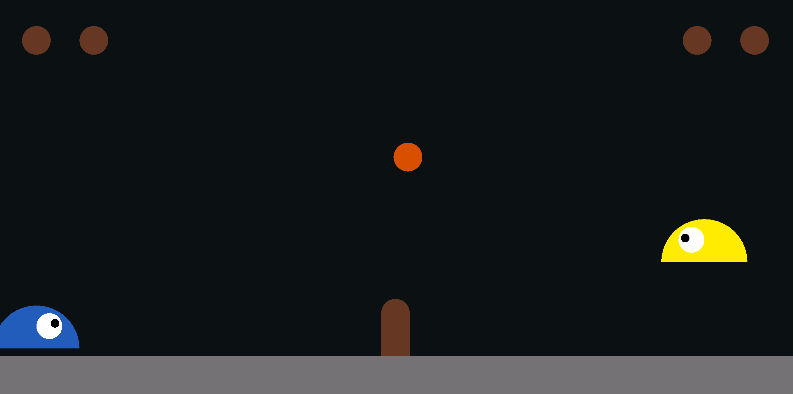
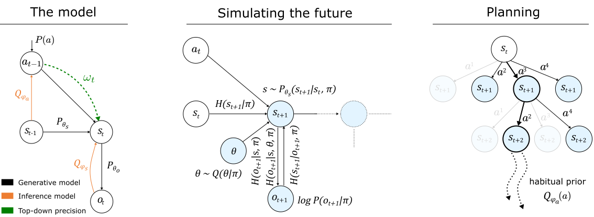
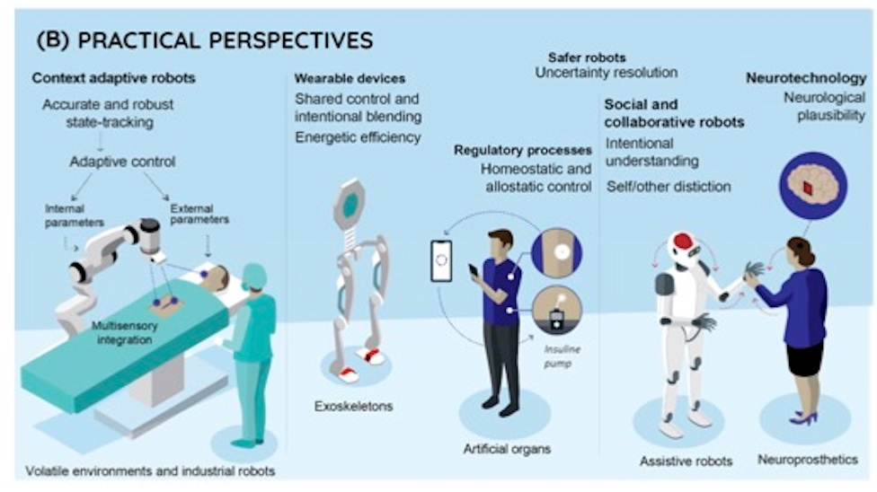
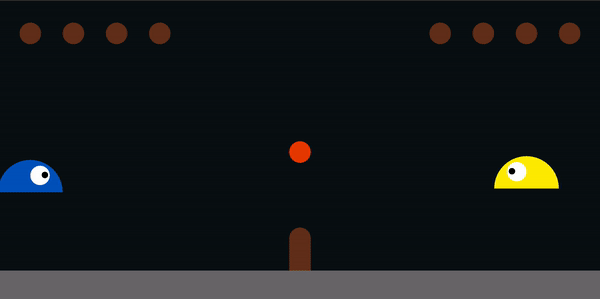
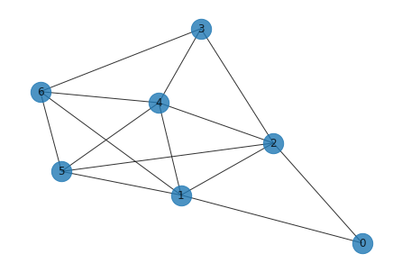
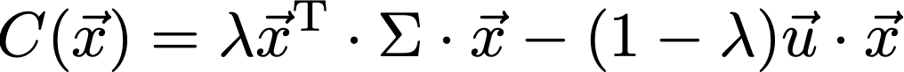
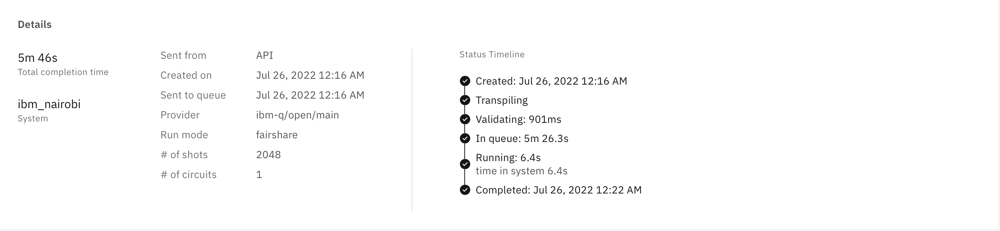
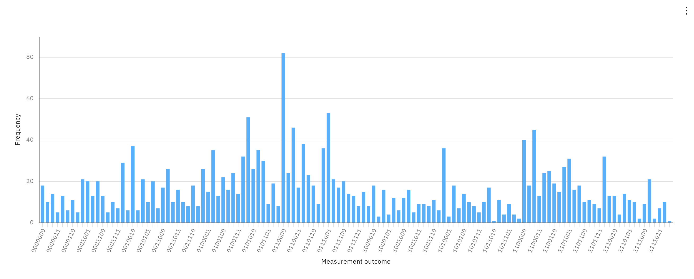

# Section 1: Active inference on Xanadu

_by Simon Szalai and Pierre-Luc Dallaire-Demers_

Given many recent demonstrations of quantum computational advantage, we seek to evaluate if this resource can be transformed into quantum application advantage. More specifically, we consider the case of a potential advantage in multiplayer environments, where different sources and models of quantum advantage can be compared systematically.

For open environments, the framework of active inference is ideal for measuring the effects of quantum computational advantage in multiplayer settings, since agents have to simulate the future behavior of others using generative models. The presence of computational power asymmetry between agents can therefore modulate the outcome of the rounds of interaction between the agents.

In this demonstration, we implemented the deep active inference framework of Fountas [1] in the Slime Volleyball environment of Ha [5]. We compared the performance of a quantum and classical agent. The quantum agent was able to sample from a fixed distribution coming from a 8-mode gaussian boson sampler from Xanadu.

We could not demonstrate a quantum application advantage with a fixed distribution. We believe the parameters and the models can be improved. We also propose tuning the parameters of the gaussian boson sampler with PennyLane such that the quantum distribution can also be trained.

## Instructions

### Initial Setup

```
pyenv local 3.8.12               # Set local Python version
python -m venv .venv             # Create virtual environment
source .venv/bin/activate        # Activate virtual environment
pip install -r requirements.txt  # Install required packages from PyPI
pip install -e .                 # Install 'quantum-dueling-slimes' in editable mode
pip install -e ./slimevolleygym  # Install 'slimevolleygym' in editable mode

```

### Training

```
python src/train/train.py -p [TRAINING_RUN_NAME] -r [RENDER] -e [EPOCHS]
```

TRAINING_RUN_NAME (str):
Folder name (within `training_files` folder) where the files related to the training (TensorBoard logs and saved models) should be saved. If empty, an date based auto-generated name will be used. The model gets automatically saved every 25 epochs.
RENDER (bool):
Shows training progress by rendering the environment, but also slows down training.
EPOCHS (int):
Number of epochs (games) to train. Default is 300, which is ideal for development as it trains relatively fast (~20min) and decent convergence can be observed. It could make sense to increase it to around 1000 as it improves convergence significantly.

### Inference

```
python src/run/run.py -n training_files/[TRAINING_RUN_NAME]/saved_models/epoch_[EPOCH_TO_LOAD] -ea [EXPORT_ACTIONS]
```

TRAINING_RUN_NAME (str): Name of the training run (same as in training) to be loaded.
EPOCH_TO_LOAD (int): Epoch number to be loaded. Make sure that it exists in the corresponding training_files folder.
EXPORT_ACTIONS (str): Name of the run where the actions are exported in the end (in `run_files` folder).

### Replay

MCTS can take a long time to compute, which dramatically reduces the frame rate. To have a more pleasant way to watch the games, the sequence of actions during inference are saved to a json file (specified under -ea flag). Using the command below, the pre-generated games can be smoothly replayed (using the same environment).

```
python src/run/replay.py -ia [IMPORT_ACTIONS]
```

IMPORT_ACTIONS (str): Name of the run where the actions were exported in the end of inference (in `run_files` folder). Corresponds to the EXPORT_ACTIONS flag on the inference script.

### Commands to recreate the videos

The commands below were the ones used to create the videos in the presentation. All the files required to run them are committed to the repo.

### Training

```
python src/train/train.py -p baseline -e 300
```

Training logs:

```
tensorboard --logdir training_files/logs
```

### Inference

Classical vs. classical:

```
python src/run/run.py -n training_files/baseline/saved_models/epoch_300 -ea classical-vs-classical
```

Classical vs. quantum:

```
python src/run/run.py -n training_files/baseline/saved_models/epoch_300 -ea classical-vs-quantum
```

### Replay

Classical vs. classical:

```
python src/run/replay.py -ia classical-vs-classical
```

Classical vs. quantum:

```
python src/run/replay.py -ia classical-vs-quantum
```

## Design Choices

### Active Inference

Active inference is a way of understanding conscious behavior. It is a theory that characterizes perception, planning, and action in terms of probabilistic inference [3]. It is a first principles approach (minimal assumptions) to understanding behavior and the brain, through the one and only motivation which is to minimize the free energy. Naturally, it has provided an interesting and unified perspective on cognition and behavior, increasingly used across many disciplines including neuroscience and psychology.
In active inference, one defines “agents” with a prior model explaining their surroundings. The goal of these agents is to learn about the environment through two main mechanisms: (1) Make observations to correct their model (2) Perform actions to reduce uncertainty in the future observations. Precisely, one defines sets for hidden states (of the environment), observations (drawn randomly from the hidden states) and actions for discrete time steps of the evolution and tries to minimize the “surprise” defined as the negative log-likelihood of the probability of an observation record, up to that time.

### Multiplayer benchmarking environment

We picked the deep active inference framework of Fountas [1] because it is the first open source implementation that uses deep neural networks and Monte Carlo methods to make the inference computationally tractable (see figure 1). It is built in Tensorflow, which means that it can be made to include quantum components by using Pennylane.

_Figure 1: Structure of the neural networks [1] used for active inference._

We changed the environment of the original deep active inference codebase to a more dramatic and visually appealing environment: the Slime Volleyball Gym environment of Ha [5]. The environment can be simulated and rendered quickly and it is multiplayer. The two players (slime blue and slime yellow) can have different neural networks.

To study the behavior of the agents when given access to samples from computationally intractable distributions, the Borealis device (see figure 2) from Xanadu [6] can be used. However, we were only able to access the X8 device and performed our experiment on 8 modes instead of 216.


_Figure 2: The Borealis device [6] can generate samples from a computationally intractable distribution._

Theoretically, one could wire in the gaussian boson samplers through Pennylane and use them as a parametrized source of intractable samples for the neural networks of the active inference agents. In the interest of time, we simply recorded a large number of samples from the X8 device and used those as input to an extended version of the habitual network used in the deep active inference framework.

How do we compare the performance of the quantum and classical agents?
If the parameters and models were finely tuned, one could look at the final score of the games to compare the quantum and classical agents. For the time of this hackathon, we choose to look at the qualitative behavior of the agents over short simulated rounds of gameplay.

### Applications in robotics

Quantum advantage in multiplayer active inference environments can have business applications in robotics and other fields with autonomous agents such as finance. As a unifying framework for explaining and designing adaptive systems, active inference has been used to simulate a wide range of behaviors in neuroscience, machine learning, and robotics [2]. Inherently, it is useful in robotics because it unifies state-estimation, control and model learning as inference processes that are solved by optimizing free energy. Modeling the agents’ behavior with a generative model, ensures robustness and adaptivity in the presence of noise, and external fluctuations. Active inference performance is a mixture of information and goal-seeking policies that are explicitly encoded in the generative model as priors, which can be specified by the user.

To be specific, active inference can be used for those specific applications:

- Realizing context-adaptive robots in contrast to robots which optimize accuracy risk, only, and consequently avoids overfitting [2].
- Agents in active inference continuously reduce uncertainty by selecting suitable actions, allowing for a behavior that is accompanied with a quantifiable measure of risk. When uncertain about a situation, they can/should seek guidance from the user through shared control.
- Active inferring robots model others’ intentions to predict others’ actions. This allows robots to operate safely in social environments. This is also useful in games, where predicting the opponent’s action is of utmost importance. This is the subject of our experience, in this hackathon.
- Development of smart and wearable devices with a degree of autonomy, such as exoskeletons.
- The neurological functional plausibility of adaptive inference can facilitate integration with the nervous system. Monitoring brain activity helps predict neural responses, such as seizures, and anticipate the required intervention.


_Figure 3: Applications of Active Inference Figure taken from the Ref. [2]_

## Technical Explanation of the Codebase

### Neural Networks & Training

Within the active inference framework, 3 neural networks were trained. A brief summary of their purpose and method of training follows:

#### Habitual Network

**Purpose**: The main purpose of the habitual network is to increase the efficiency of MCTS (Monte Carlo Tree Search). It can be compared to habit forming of biological agents, where habits reduce the computational burden in frequently encountered situations. It takes a state as an input, and returns a probabilty distibution over actions as an output. This probability distribution is used in two ways within the active inference framework. First, if one of the actions has much higher probability than the rest, it is just selected, then the whole MCTS process can be skipped. Second, if this is not the case, it is used to bias the MCTS process by adding extra probability for those actions that were frequently selected according to the habitual network.

**Training**: The habitual network was trained to mimic the actions taken by the baseline policy provided by the `slimevolleygym` environment. This baseline policy is a tiny, 120-parameter Recurrent Neural Network (RNN). During training, besides the agent, a 'shadow' agent, an instance of the baseline policy was set up, which also predicted an action for the same observation as the agent. This predicted probability distribution over actions was passed to the habitual network, where the loss was defined as the Kullback-Leibler Divergence between this, passed distribution and the one predicted by the habitual network.

#### Transition Network

**Purpose**: The transition network is a variational autoencoder that takes a state and an action as its input, and predicts what the next state should be. This represents the agent's internal model, which can be thought of as the agent's understanding of the dynamics of the environment where it lives. With another words: if the agent is in a particular state and takes a specific action, what happens next? How will the environment react?

**Training**: During training, in each state the agents predict what the next state will be, given that a particular action is taken. After that, the same action is applied to the environment, which returns the next state, the actual result of that action. The loss is defined as the Kullback-Leibler Divergence between the predicted next state and the actual next state. The agent will strive to minimize the difference (surprise), effectively learning the dynamics of the environment.

#### Encoder Network

**Purpose**: The encoder network is also a variational autoencoder, which has the task of encoding a high-dimensional observation to a low-dimensional latent space. In our experiments we directly accessed the state of the environment, which is a 12-dimensional vector, so in this particular case the encoder network was not particularly useful. In other use cases, for example where the observations that the agent receives are raw pixels, the encoder network (for example by using a few convolutional layers) can transform these observations to tractable latent states.

**Training**: During training, an observation is passed to the encoder network. First the network encodes the observation to a latent state, then it decodes it back to a predicted observation. The binary cross-entropy between the actual and predicted observations will be the first term of the loss. The second term will be the Kullback-Leibler Divergence between the encoded state and the state predicted by the transition network.

### Monte Carlo Tree Search

Monte Carlo Tree Search is a technique to select the action that yields the lowest free energy, considering the foreseeable future. The way it works if the following:

- **Phase A**: This phase is just a performance optimization. The habitual network predicts a probabilty distribution over actions, and if one of the actions are much more likely than all the others, that action is selected and the rest of the MCTS process is skipped.

- **Phase B**: This is the main MCTS loop. It is executed many times (few hundreds), until one of the actions reach a probability that exceeds the threshold. In each iteration, first the most traversed path is traversed again, down to the last (leaf) node. Here Expected Free Energy is calculated for every action and stored in the node. After that, the node is expanded: a new child node is added for each possible action. These children nodes are initialized with states predicted by the transition network, using the state of their parent nodes and the action that leads to them as inputs. After that, an MCTS simulation is launched from the leaf node (the same node that got expanded): alternating the transition and habitual networks to a pre-configured depth, a likely path into the future is generated. Finally, the Expected Free Energy of this path is calculated, which is backpropagated to all the nodes in the chain that lead to the current leaf node.
  This loop is repeated until an action reaches the threshold: then the action with the lowest Expected Free Energy is selected. If none if them does until the repetition limit is reached, MCTS moves to the final phase, C.

- **Phase C**: Since no action is an obvious winner, but one still has to be selected, the final action is choosen the same way as if one would reach the threshold in Phase B: the starting action of the path that results in the lowest total Expected Free Energy.

### Quantum Noise

Quantum noise was retrieved though Xanadu Cloud using `strawberry_fields`. There are 2 files committed to the repo: `quantum_noise/x8.py` and `quantum_noise/borealis.py`. Both of them does the same thing: run a circuit to sample 10000 shots of quantum noise, then saves the results to several files, so they can be used later, during training or inference. This is done purely for performance optimization purposes, as it takes areound 20s to execute the quantum circuit, and if that has to be done every iteration of the training (which normally takes a few milliseconds), training becomes intractable very fast.

## Results

1. **Classical vs. classical - trained against baseline**

   

   In this scenario, two identical classical agent play against each other. They have the same network architecture and the same weights. The weights were obtained by training them against the baseline RNN policy, as described below. Both of them use the habitual network for faster action selection (when the habitual network is confident enough), and also they use the haitual network to bias the MCTS process towards actions that are more likely to be selected by the habitual network. As it is visible on the video below, the agents mostly struggle to hit the ball, this is due to the lack of hyperparameter tuning (time constraints of the Hackathon), and selection of hyperparameters that prioritize speed instead of accuracy (training on a laptop CPU).

2. **Classical vs. quantum - trained against baseline**

   _blue: quantum, yellow: classical_

   

   In this scenario, the only difference from the above case is that the quantum agent (the blue one on the left), has some quantum noise obtained from Xanadu's X8 device injected as additional input of its habitual network. In the classical agents, the noise is replaced with zeros. As visible on the video, the agent performs slightly worse than the classical counterpart, as expected. The reason for this is that the classical agent wasn't trained against the quantum agent, so it is not in a disadvantage of predicting it's opponent's behavior. On the other hand, the quantum agent has extra noise added, so it can hit the ball even less accurately.
   Also, since the quantum layer was not trainable, and it didn't have feedback during training, the added quantum noise degraded the agent's performance. If the quantum sampler would be trainable as well (through PennyLane), it could add such a noise that still makes it unpredictable for the opponent, but does not degrade its performance.

3. **Classical vs. quantum - trained against each other**

   This is the final goal that we strive to achieve, but some dependencies could not be completed due to time constraints. Here we expect to see a clear advantage of the quantum agent, as it can produce behavior that is unexpected for it's opponent.

## Limitations & Future work

### Major items

- **Tuning the networks**: Given the 48h time constraint of the Hackathon, unfortunately we were not able to spend enough time experimenting and tuning the hyperparameters such that the active inference agent outperforms the baseline. To progress further, this has to be done first.
- **Make the quantum sampler trainable**: Since the parameters of the gaussian boson samplers were not trained along with the neural networks of the agents, the quantum agent may not have been able to fully leverage the computational advantage from the samples. This may explain in part the degradation of the performance of the quanum agent in this experiment. In the case where the parameters of the gaussian boson sampler could be trained through Pennylane, all parameters could be set to zero such that the performance would not be worse than the classical agent. Hence the ability to train the parameters of the quantum sampler would guarantee that the quantum agent performs at least as well as the classical agent.
- **Train a classical agent against a quantum agent**: Once the classical agents have the ability to play the game with a relatively high accuracy, we can train a classical agent (no quantum noise added, zeros as placeholders instead) and a quantum agent (quantum noise added to the input of the habitual network). Since the agents have to model each other's behavior in order to win the game, we expect to see a clear advantage of the quantum agent, as the classical one will struggle to model it's opponent's behavior.
- **Better quantum noise**: During our experiments, unfortunately Xanadu's latest device, Borealis was offline, so we couldn't use it to generate the noise added to the habitual network. Instead, we used X8, which has 8 qmodes, opposed to the 216 modes of Borealis. The quantum distribution generated by X8 is not intractable classically, so - in theory - the classical agent could learn that distribution. In practice, however, the relatively small neural networks that we used (512-node dense layers), most likely lack the capacity to do that.
- **Speed up MCTS**: MCTS is the clear bottleneck during action selection. Several things can be done to make it faster:
  1. Refactor the code so it can run with Eager execution disabled
  2. Parallalize blocks of computation that doesn't depend on each other's outputs
  3. Tune and optimize hyperparameters of MCTS

### Minor items

- **Improve performance**: Since random sampling is involved for each free energy calculation, it reduces jitter and improves performance if free energy is calculated multiple times and an average is used. Currently this is calculated in a for loop. Since the calculations are independent from each other, this could be paralllelized using multiprocessing to speed up training and inference.
- **Reduce jitter**: When actions are predicted multiple timesteps in the future, sometimes it occurs that subsequent actions cancel each other out (e.g. left, then right). By removing these jitter could be reduced and performance could be increased.

## References

[1] Fountas, Z., Sajid, N., Mediano, P. A. M, and Friston, K., Deep active inference agents using Monte-Carlo methods,arXiv:2006.04176 https://github.com/zfountas/deep-active-inference-mc (2020).

[2] Da Costa, L., Lanillos, P., Sajid, N.;,Friston, K., and Khan, S. How Active Inference Could Help Revolutionize Robotics. Entropy, 24, 361(2022).

[3] Parr, T., Pezzulo, G. and Friston, K. J., Active Inference: The Free Energy Principle in Mind, Brain, and Behavior, MIT Press (2022).

[4] Cepelewicz, J., To Make Sense of the Present, Brains May Predict the Future, Quanta Magazine, July (2018).

[5] Ha, D., Slime Volleyball Gym Environment, https://github.com/hardmaru/slimevolleygym (2020).

[6] Madsen, L.S., Laudenbach, F., Askarani, M.F. et al. Quantum computational advantage with a programmable photonic processor. Nature 606, 75–81 (2022).

# Section 2 (IBM Challenge) Portfolio optimization on IBM Nairobi

_by Ezad Shojaee_

**Problem statement:** Find the best way to choose the subset of the set of all stocks, which optimizes financial objectives (maximizing returns/minimizing the investment risks).
The toy example we implemented is coded on the Nairobi machine which has seven qubits (assets) in a graph like this



The coded cost function reads:


Where the quadratic term captures the risk and the linear one captures the return; is a control parameter adjusting the risk one wants to take. For details on calculations and the descriptions, see [Jupyter Notebook](qaoa/QAOA_for_PortOpt.ipynb)


After running the task on the Nairobi machine on IBM, we see the histogram of the measurement outcomes. The most probable bit-string captures the partition, encoding the solution.



## References

[1] Hodson, M., Ruck, B., Ong, H., Garvin, D., and Dulman, S., Portfolio rebalancing experiments using the Quantum Alternating Operator Ansatz, arXiv:1911.05296

[2] https://www.zorc-finance.com/post/optimal-portfolios-with-qaoa
